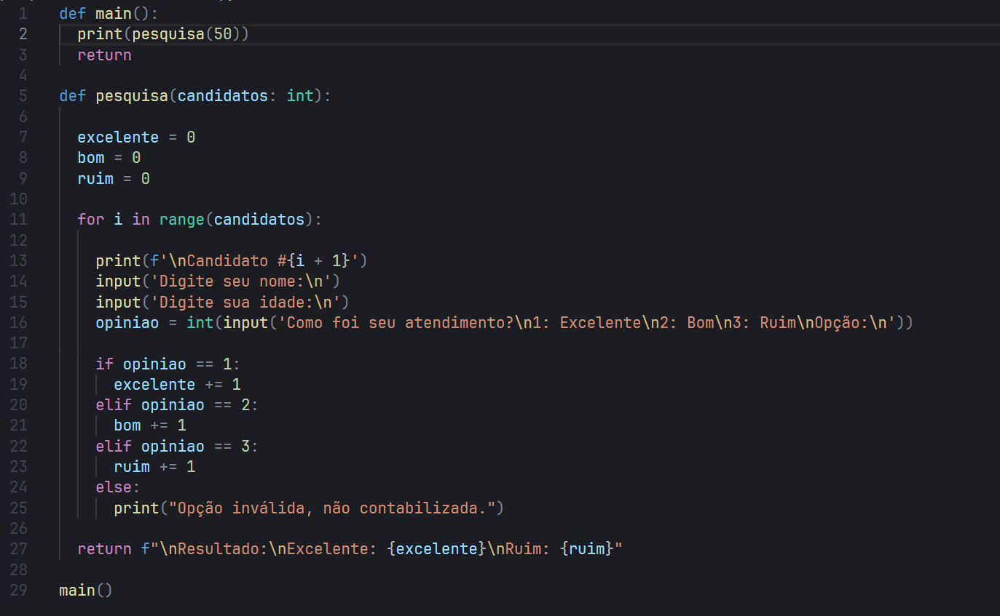
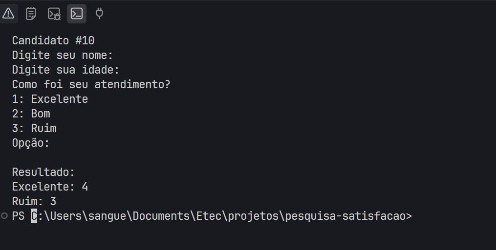

# 📊 Pesquisa de Opinião


Este projeto realiza uma pesquisa de satisfação sobre o atendimento prestado aos clientes.

## Como funciona

O programa solicita:

- Nome do entrevistado;
- Idade;
- Opinião sobre o atendimento.

As opções disponíveis são:

```text
1 - Excelente
2 - Bom
3 - Ruim
```

O programa utiliza estruturas de repetição e decisão para registrar as respostas e contabilizar os resultados.

Ao final, são exibidas as quantidades de respostas:

- Excelente;
- Ruim.

## Como executar

No terminal, dentro da pasta do projeto, execute:

```bash
python app.py
```

## Testes

Foram realizados testes com 10 entrevistados para validar o funcionamento do programa.

## Prints

### Código



### Execução



Projeto feito em Python. 🐍📊
